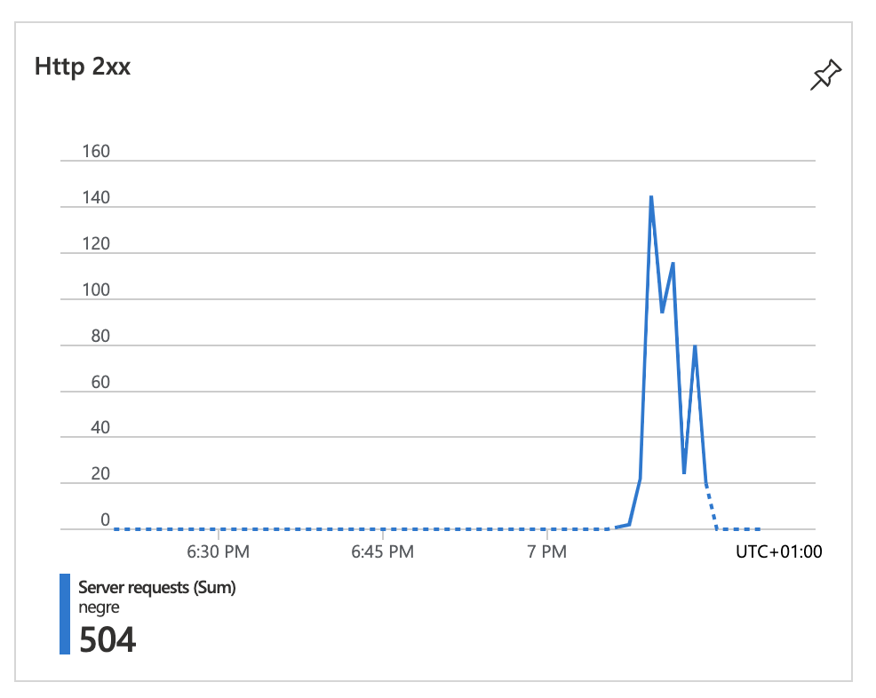
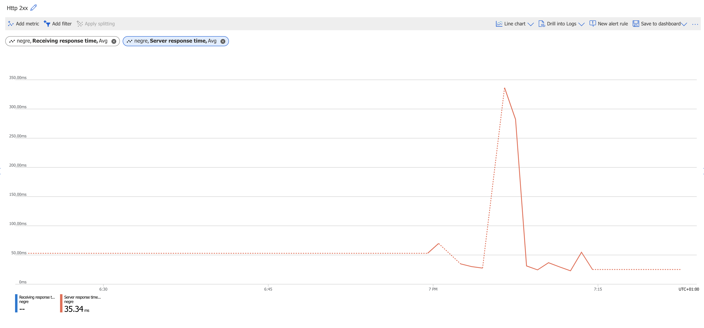
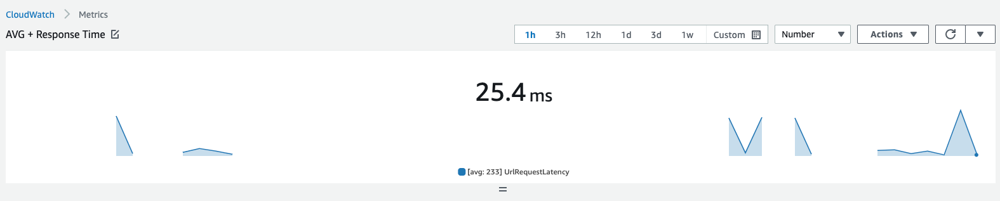
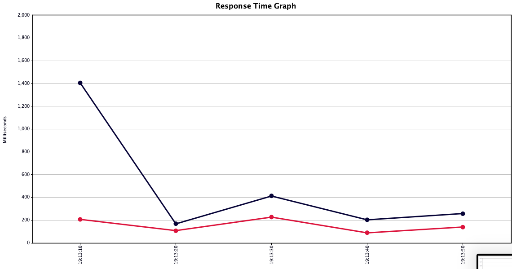
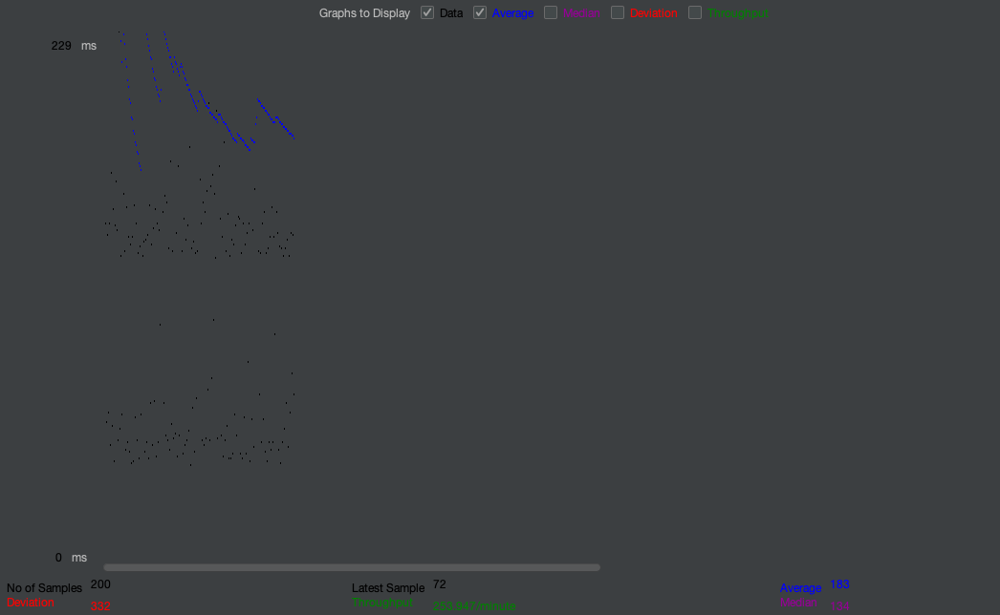

# About

[Antoine Sutter](mailto:antoine.sutter@hes-so.ch)

Serverless functions are a type of cloud computing service that allows developers to run code without having to manage the underlying infrastructure. This means that developers can focus on writing and deploying their code, without having to worry about things like setting up and maintaining servers.

Azure is a cloud computing platform developed by Microsoft. It offers a range of cloud services, including serverless functions, that can be used to build, deploy, and manage applications.

Google Cloud is a cloud computing platform developed by Google. It offers a range of cloud services, including serverless functions, that can be used to build, deploy, and manage applications.

AWS, or Amazon Web Services, is a cloud computing platform developed by Amazon. It offers a range of cloud services, including serverless functions, that can be used to build, deploy, and manage applications.

# Deliverables (D1.1) AWS:

In Python 3, you can load environment variables using the os module. This module provides a way to access operating system-specific functionality, including the ability to retrieve environment variables.

Here is the updated code to use enviroment variables instead.

```python
import boto3
import json
import os

dynamo = boto3.client('dynamodb')
table_name = os.environ['TABLE_NAME']


def respond(err, res=None):
    return {
        'statusCode': '400' if err else '200',
        'body': err.message if err else json.dumps(res),
        'headers': {
            'Content-Type': 'application/json',
        },
    }


def lambda_handler(event, context):
    '''Demonstrates a simple HTTP endpoint using API Gateway. You have full
    access to the request and response payload, including headers and
    status code.

    To scan a DynamoDB table, make a GET request with the TableName as a
    query string parameter. To put, update, or delete an item, make a POST,
    PUT, or DELETE request respectively, passing in the payload to the
    DynamoDB API as a JSON body.
    '''
    print("Received event: " + json.dumps(event, indent=2))

    operations = {
        'DELETE': lambda dynamo, x: dynamo.delete_item(**x),
        'GET': lambda dynamo, x: dynamo.scan(**x),
        'POST': lambda dynamo, x: dynamo.put_item(**x),
        'PUT': lambda dynamo, x: dynamo.update_item(**x),
    }

    operation = event['requestContext']['http']['method']
    if operation in operations:
        payload = {"TableName": table_name} if operation == 'GET' else json.loads(event['body'])
        return respond(None, operations[operation](dynamo, payload))
    else:
        return respond(ValueError('Unsupported method "{}"'.format(operation)))
```

# Deliverables (D1.2) GCP:

Similarly to AWS you can just use the os python module to load environement variables.

```python
from google.cloud import datastore
import json
import os

def query(request):
    """Responds to any HTTP request.
    Args:
        request (flask.Request): HTTP request object.
    Returns:
        The response text or any set of values that can be turned into a
        Response object using
        `make_response <http://flask.pocoo.org/docs/1.0/api/#flask.Flask.make_response>`.
    """
    l = list()

    client = datastore.Client()
    # use the value of DATABASE_TABLE environement as the kind
    query = client.query(kind=os.environ["DATABASE_TABLE"])
    l = query.fetch()
    l = list(l)
```

# Deliverables (D1.3) Azure:

To use environment variables in an Azure Functions app, you can update your function.json file to reference the environment variable. Here's an example of how you might do that:

1. In your function.json file, locate the section where you want to use the environment variable. For example, if you want to use an environment variable for a database connection string, you might have a section that looks like this:

```json
"bindings": [
    {
      "type": "cosmosDBTrigger",
      "name": "inputDocument",
      "direction": "in",
      "leaseCollectionName": "leases",
      "connectionStringSetting": "MY_DATABASE_CONNECTION_STRING",
      "databaseName": "mydatabase",
      "collectionName": "mycollection"
    }
]
```

2. In this example, the connectionStringSetting value is currently set to a hard-coded string `MY_DATABASE_CONNECTION_STRING`. To use an environment variable instead, you can update this value to reference the environment variable using the `%<variable>%` syntax. Here's how that might look:

```json
"bindings": [
    {
      "type": "cosmosDBTrigger",
      "name": "inputDocument",
      "direction": "in",
      "leaseCollectionName": "leases",
      "connectionStringSetting": "%MY_DATABASE_CONNECTION_STRING%",
      "databaseName": "mydatabase",
      "collectionName": "mycollection"
    }
]
```

3. Finally, you'll need to define the environment variable in your Azure Functions app. To do this, you can use the Azure Portal to add a new environment variable to your app. To do this, follow these steps:

- Navigate to your Azure Functions app in the Azure Portal.
- In the left-hand navigation, click on "Configuration" under the "Settings" section.
- Scroll down to the "Application Settings" section and click on the "New application setting" button.
- In the "Add a new application setting" form, enter the name of your environment variable (e.g. `MY_DATABASE_CONNECTION_STRING`) in the "Name" field and the value for the variable in the "Value" field.
- Click "OK" to save the new environment variable.

Here is the Music example update with the correct syntax.

`__init__.py`

```python
import logging
import json
import azure.functions as func

def main(req: func.HttpRequest, doc:func.DocumentList) -> func.HttpResponse:
    logging.info('Python HTTP trigger function processed a request.')

    entries_json = []

    for entry in doc:
        entry_json = {
            "id": entry['id'],
            "AlbumTitle": entry['AlbumTitle'],
            "Artist": entry['Artist'],
            "SongTitle": entry['SongTitle'],
            "Awards": entry['Awards'],
        }
        entries_json.append(entry_json)

    return func.HttpResponse(
        json.dumps(entries_json),
        status_code=200,
        mimetype="application/json"
    )
```

`function.json`

```json
{
  "scriptFile": "__init__.py",
  "bindings": [
    {
      "authLevel": "anonymous",
      "type": "httpTrigger",
      "direction": "in",
      "name": "req",
      "methods": ["get", "post"],
      "route": "music/list"
    },
    {
      "type": "cosmosDB",
      "direction": "in",
      "name": "doc",
      "databaseName": "%COSMOS_DATABASE%",
      "collectionName": "%COSMOS_COLLECTION%",
      "createIfNotExists": "true",
      "connectionStringSetting": "AzureCosmosDBConnectionString",
      "sqlQuery": "SELECT * from c"
    },
    {
      "type": "http",
      "direction": "out",
      "name": "$return"
    }
  ]
}
```

# Deliverables (D2)


## Azure

There can be differences in the cold start time of a serverless function when comparing the stats in the Azure dashboard to using a third-party tool to test the function directly for a few reasons.

First, the Azure dashboard only provides an average cold start time for the function, which may not accurately reflect the cold start time for a specific execution of the function. The actual cold start time for a specific execution of the function can vary depending on factors such as the workload on the system and the function's runtime environment.

Second, the Azure dashboard only provides statistics for invocations of the function that are made through the Azure platform. If a third-party tool is used to test the function directly, the statistics for those invocations will not be included in the Azure dashboard. This can lead to differences in the reported cold start time, since the third-party tool may be making invocations at different times or under different conditions than the invocations made through the Azure platform.

Third, the Azure dashboard only provides statistics for successful invocations of the function. If a third-party tool is used to test the function and it encounters errors, those errors will not be included in the Azure dashboard statistics. This can also lead to differences in the reported cold start time, since the errors may cause delays in the function's execution.

Overall, there can be differences in the cold start time of a serverless function when comparing the stats in the Azure dashboard to using a third-party tool to test the function directly due to the factors discussed above.




## AWS:





## Google

As a student, I was excited to try out Google Cloud Computing and see how it could help me with my schoolwork. I signed up for a free trial and started using the platform, but I quickly ran out of free credits.

At first, I thought that I would just have to wait until the next month to get more credits, but then I realized that I would have to provide my credit card information to continue using the platform. As a student, I am on a tight budget and can't afford to pay for Google's cloud computing services. I also don't feel comfortable giving my credit card information to a company like Google.

As a result, I am unable to continue using Google Cloud Computing. I am disappointed that I can't take advantage of this valuable resource, but I understand that it is not the right fit for me at this time. I will continue to look for other ways to improve my schoolwork and complete my assignments.

# Openwick

To create an action in OpenWhisk, you can use JavaScript or Python as the runtime language for your action. Here's an example of creating an action using JavaScript:

```
wsk action create helloWorld hello.js
```

This will create an action named helloWorld using the JavaScript file hello.js as the source code for the action.

Here's an example of creating an action using Python:

```
wsk action create helloWorld hello.py
```

This will create an action named helloWorld using the Python file hello.py as the source code for the action.

Once you've created your action, you can invoke it using the wsk action invoke command, like this:

```
wsk action invoke helloWorld
```

This will run the helloWorld action and return the output of the action.

# Deliverables (D3):

## 1. How can you observe a cold start?

When an OpenWhisk action is invoked for the first time, or after not being used for an extended period of time, it will go through a "cold start". During a cold start, the action's runtime environment is started, which can take some time. This can cause a delay in the action's response time.

To observe a cold start, you can create an OpenWhisk action and then wait for an extended period of time before invoking it. This will cause the action to go through a cold start when it is invoked. You can then measure the action's response time to see the effect of the cold start.

Here's an example of creating an action using JavaScript and then invoking it to observe a cold start:

```
wsk action create helloWorld hello.js

# Wait for an extended period of time

wsk action invoke helloWorld
```

This will create the helloWorld action and then wait for an extended period of time before invoking it. When the action is invoked, it will go through a cold start before it is executed. You can then measure the action's response time to see the effect of the cold start.

## 2. How does OpenWhisk avoid a cold start when you invoke the same action (function) several times in a short period of time?

When an OpenWhisk action is invoked, the action's runtime environment is started, which can cause a delay in the action's response time. This delay is known as a "cold start".

To avoid cold starts, OpenWhisk maintains a pool of pre-warmed runtime environments for each action. When an action is invoked, if there is a pre-warmed runtime available in the pool, it is used to execute the action. This avoids the delay caused by starting a new runtime environment and allows the action to be executed quickly.

Here are the steps that OpenWhisk takes to avoid cold starts when an action is invoked:

1. When an action is created, OpenWhisk automatically starts one or more runtime environments for the action. These runtime environments are added to a pool of pre-warmed runtime environments for the action.

2. When an action is invoked, OpenWhisk checks the pool of pre-warmed runtime environments for the action. If a pre-warmed runtime environment is available, it is used to execute the action.

3. If no pre-warmed runtime environments are available, a new runtime environment is started for the action and used to execute the action. This can cause a delay, known as a cold start.

4. After the action is executed, the runtime environment is returned to the pool of pre-warmed runtime environments for the action. This allows the runtime environment to be used for subsequent invocations of the action, avoiding any further cold starts.

By maintaining a pool of pre-warmed runtime environments and using them to execute actions, OpenWhisk is able to avoid cold starts and provide fast response times for actions.

## 3. Where are stored all your actions code in OpenWhisk when the function is not running at all?

In OpenWhisk, when an action is not running, its source code is stored in the OpenWhisk system. When the action is invoked, the source code is retrieved from the system and used to start a runtime environment for the action. The runtime environment is then used to execute the action.

You can view the source code for your actions using the wsk action get command. For example, to view the source code for an action named helloWorld, you can use the following command:

```
wsk action get helloWorld
```

This will retrieve the source code for the helloWorld action and display it in the terminal.

The source code for your actions is stored in the OpenWhisk system, and is retrieved and used when the action is invoked. This allows the action to be executed quickly, without the need to store the source code on the local machine.
