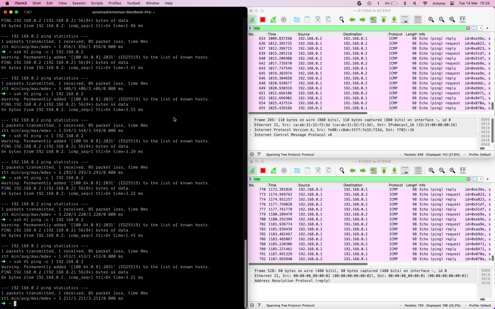

---
pdf_options:
  format: a4
  margin: 30mm 20mm
  printBackground: true
  headerTemplate: |-
    <style>
      section {
        margin: 0 auto;
        font-family: system-ui;
        font-size: 11px;
      }
    </style>
    <section>
      <span>Antoine Sutter</span>
    </section>
  footerTemplate: |-
    <section>
      <div>
        Page <span class="pageNumber"></span>
        / <span class="totalPages"></span>
      </div>
    </section>
---

# Prelude

Pour commencer, il est important de noter que ce travail a été réalisé en JavaScript et non en Python. Ceci a été vu en classe avec le professeur, et il a été convenu que ce n'était pas un problème.

# 1. Génération automatique du fichier client SSH

Afin de generer les fichiers de configuration SSH, j'ai écrit du code en JavaScript à l'aide de [google/zx](https://github.com/google/zx). Ce package permet d'écrire du code JavaScript qui est exécuté dans un shell. Il est donc possible d'utiliser des commandes comme `ls`, `cat`, `mkdir`, `rm`, etc. Il est également possible d'utiliser des variables, des boucles, des conditions, etc, comme dans n'importe quel autre programme JavaScript.

Ainsi, je peux executer des commandes facilement depuis du JavaScript. Par exemple:

```ts
await $`chmod +x hostnames.sh`;
```

Afin de ne pas avoir à me souvenir des commandes nécessaire de tailscale, j'ai ajouté les commandes utiles en tant que scripts dans mon ficher `package.json`. Je peux ensuite les appeler à l'aide de npm. Par exemple:

```
npm run up
```

Executera la commande

```
/Applications/Tailscale.app/Contents/MacOS/Tailscale up --login-server https://tailscale.hepiapp.ch
```

Une fois que tailscale est lancé, j'ai tout ce qu'il me faut pour generer le fichier de configuration SSH pour un project donné. Je peux donc lancer la commande suivante pour generer le fichier de configuration SSH pour le project `switched_config`:

```
npm run generate_ipv4 -- --project switched_config
```

Output:

```
> generate_ipv4
> zx ./scripts/generate_ipv4.mjs --project switched_config

$ fetch http://gns3.hepiapp.ch/v2/projects
$ fetch http://gns3.hepiapp.ch/v2/projects/fdb0cae1-82f5-42cb-8d2a-4ccdc8528f14/nodes
$ touch ipv4.sh
$ echo $'#!/bin/bash\n  \necho "adding ip addresses"\nssh H1 ip address add 192.168.0.1/24 dev eth0\nssh H1 ip link set eth0 addr 00:00:00:00:00:1\nssh H1 ip link set dev eth0 up\n\nssh H2 ip address add 192.168.0.2/24 dev eth0\nssh H2 ip link set eth0 addr 00:00:00:00:00:2\nssh H2 ip link set dev eth0 up\n\nssh H3 ip address add 192.168.0.3/24 dev eth0\nssh H3 ip link set eth0 addr 00:00:00:00:00:3\nssh H3 ip link set dev eth0 up\n\nssh H4 ip address add 192.168.0.4/24 dev eth0\nssh H4 ip link set eth0 addr 00:00:00:00:00:4\nssh H4 ip link set dev eth0 up\n\necho "pinging"\nssh H1 ping 192.168.0.2 -c 1\nssh H1 ping 192.168.0.3 -c 1\nssh H1 ping 192.168.0.4 -c 1' > ipv4.sh
$ chmod +x ipv4.sh
```

Cette commande nous genère le fichier bash suivant:

```bash
#!/bin/bash

echo "adding ip addresses"
ssh H1 ip address add 192.168.0.1/24 dev eth0
ssh H1 ip link set eth0 addr 00:00:00:00:00:1
ssh H1 ip link set dev eth0 up

ssh H2 ip address add 192.168.0.2/24 dev eth0
ssh H2 ip link set eth0 addr 00:00:00:00:00:2
ssh H2 ip link set dev eth0 up

ssh H3 ip address add 192.168.0.3/24 dev eth0
ssh H3 ip link set eth0 addr 00:00:00:00:00:3
ssh H3 ip link set dev eth0 up

ssh H4 ip address add 192.168.0.4/24 dev eth0
ssh H4 ip link set eth0 addr 00:00:00:00:00:4
ssh H4 ip link set dev eth0 up

echo "pinging"
ssh H1 ping 192.168.0.2 -c 1
ssh H1 ping 192.168.0.3 -c 1
ssh H1 ping 192.168.0.4 -c 1
```

Pour pouvoir faire ça, voici comment le scripts fonctionne. En premier, je récupère les projects et les nodes de GNS3:

```ts
const { project: project_name } = argv;

if (!project_name) {
  echo("project name is required");
  exit(1);
}

const { project_id } = await get_project(project_name);
const nodes = await get_nodes(project_id);
```

Ensuite je filtre pour ne garder que les nodes qui sont des hosts:

```ts
const hosts = nodes.filter((node) => node.name.toLowerCase().startsWith("h"));
```

Je peux ensuite formatter chaque hote dans le fichier bash:

```ts
const map = new Map();

const ipAddress = hosts
  .map((host, i) => {
    const index = i + 1;
    map.set(host.name, index);
    return `ssh ${host.name} ip address add 192.168.0.${index}/24 dev eth0
ssh ${host.name} ip link set eth0 addr 00:00:00:00:00:${index}
ssh ${host.name} ip link set dev eth0 up`;
  })
  .join(`\n\n`);
```

Je choisi également un host qui testera les autres et ecrit une commande pour pouvoir ping depuis ce dernier:

```ts
const master = hosts[0];

const pings = hosts
  .filter((host) => host.name !== master.name)
  .map((host) => {
    const index = map.get(host.name);
    return `ssh ${master.name} ping 192.168.0.${index} -c 1`;
  })
  .join(`\n`);
```

Enfin, je peux écrire le fichier bash:

```ts
const output = `#!/bin/bash
  
echo "adding ip addresses"
${ipAddress}

echo "pinging"
${pings}`;

await $`touch ipv4.sh`;
await $`echo ${output} > ipv4.sh`;
await $`chmod +x ipv4.sh`;
```

Cependant, comme vous l'avez probablement remarqué dans le fichier bash généré, nous nous connectons aux nodes via SSH en utilisant des hostnames. Actuellement, mon ordinateur n'est pas configuré pour utiliser ces hostnames.

```
# Comment est-ce que ssh sait à quel host se connecter? H1?
ssh H1 ip address add 192.168.0.1/24 dev eth0
```

La première étape est d'ajouter la ligne suivante dans ma configuration SSH (`~/.ssh/config`):

```
Include config.d/
```

Cela permet de charger tous les fichiers de configuration présents dans le dossier `~/.ssh/config.d/`.

J'ai ensuite créé un script qui va générer les fichiers de configuration SSH pour chaque node. En premier, je m'assure que les bons dossiers existent et que la clé ssh est copiée dans le bon dossier:

```ts
echo(`ensuring ${CONFIG_D} exists`);
await fs.mkdirp(CONFIG_D);

echo(`ensuring ~/.ssh/gns3.rsa exists`);
await $`chmod 400 gns3.rsa`; // clé téléchargée sur la documentation du cours
await fs.copy("gns3.rsa", "~/.ssh/gns3.rsa", { overwrite: true });
```

Je récupère le projet et les nodes:

```ts
const { project: project_name } = argv;

if (!project_name) {
  echo("project name is required");
  exit(1);
}

const { name, status, project_id } = await get_project(project_name);
const nodes = await get_nodes(project_id);
```

Finalement je peux formatter chaque node.

```ts
function format_node(node) {
  return `Host ${node.name}
    User root
    Hostname ${node.console_host}
    Port ${node.console + 1}
    StrictHostKeychecking no
    UserKnownHostsFile /dev/null
    IdentityFile ~/.ssh/gns3.rsa`;
}

const output = nodes.map(format_node).join("\n\n");
```

Et écrire le fichier de configuration:

```ts
const path = `~/.ssh/config.d/gns3-current-project`;
fs.writeFile(path, output);
```

Je peux maintenant lancer le script et vérifier que les fichiers de configuration ont bien été générés:

```
npm run create
```

Output:

```
> create
> zx ./scripts/create.mjs --project switched_config

$ fetch http://gns3.hepiapp.ch/v2/projects
ensuring ~/.ssh/config.d exists
ensuring /Users/antoine/.ssh/gns3.rsa exists
$ chmod 400 gns3.rsa
$ fetch http://gns3.hepiapp.ch/v2/projects/fdb0cae1-82f5-42cb-8d2a-4ccdc8528f14/nodes
wrote /Users/antoine/.ssh/config.d/gns3-current-project
```

# 2 - Re-configuration logicielle des domaines de broadcast

Une fois le fichier `switched_line` téléchargé et importé dans GNS3, je peux tester ma configuration.

En premier, je lance le script pour créer le dossier config.d et ajouter ma clé ssh `gns3.rsa`:

```
npm run create -- --project switched_config
```

Ensuite, je lance le script pour configurer les ip addresses:

```
npm run generate_ipv4 -- --project switched_config
```

Ceci me génère le fichier `ipv4.sh`. Avant de pouvoir l'executer, je m'assure que tout les nodes sont bien démarrés:

```
npm run start_all -- --project switched_config
```

Je peux maintenant lancer le script:

```
./ipv4.sh
```

Output:

```bash
➜  nword git:(master) ✗ ./ipv4.sh
adding ip addresses
Warning: Permanently added '[100.64.0.8]:2010' (ED25519) to the list of known hosts.
Warning: Permanently added '[100.64.0.8]:2010' (ED25519) to the list of known hosts.
Warning: Permanently added '[100.64.0.8]:2010' (ED25519) to the list of known hosts.
Warning: Permanently added '[100.64.0.8]:2014' (ED25519) to the list of known hosts.
Warning: Permanently added '[100.64.0.8]:2014' (ED25519) to the list of known hosts.
Warning: Permanently added '[100.64.0.8]:2014' (ED25519) to the list of known hosts.
Warning: Permanently added '[100.64.0.8]:2018' (ED25519) to the list of known hosts.
Warning: Permanently added '[100.64.0.8]:2018' (ED25519) to the list of known hosts.
Warning: Permanently added '[100.64.0.8]:2018' (ED25519) to the list of known hosts.
Warning: Permanently added '[100.64.0.8]:2022' (ED25519) to the list of known hosts.
Warning: Permanently added '[100.64.0.8]:2022' (ED25519) to the list of known hosts.
Warning: Permanently added '[100.64.0.8]:2022' (ED25519) to the list of known hosts.
pinging
Warning: Permanently added '[100.64.0.8]:2010' (ED25519) to the list of known hosts.
PING 192.168.0.2 (192.168.0.2) 56(84) bytes of data.
From 192.168.0.1 icmp_seq=1 Destination Host Unreachable

--- 192.168.0.2 ping statistics ---
1 packets transmitted, 0 received, +1 errors, 100% packet loss, time 0ms

Warning: Permanently added '[100.64.0.8]:2010' (ED25519) to the list of known hosts.
PING 192.168.0.3 (192.168.0.3) 56(84) bytes of data.
From 192.168.0.1 icmp_seq=1 Destination Host Unreachable

--- 192.168.0.3 ping statistics ---
1 packets transmitted, 0 received, +1 errors, 100% packet loss, time 0ms

Warning: Permanently added '[100.64.0.8]:2010' (ED25519) to the list of known hosts.
PING 192.168.0.4 (192.168.0.4) 56(84) bytes of data.
From 192.168.0.1 icmp_seq=1 Destination Host Unreachable

--- 192.168.0.4 ping statistics ---
1 packets transmitted, 0 received, +1 errors, 100% packet loss, time 0ms
```

Maintenant, tout est configuré et fonctionne bien. Je peux ainsi lancer, par exemple, la commande `ssh S1 bridge link show`:

```
$ ssh S1 bridge link show
Warning: Permanently added '[100.64.0.8]:2007' (ED25519) to the list of known hosts.
2: eth0: <BROADCAST,MULTICAST,UP,LOWER_UP> mtu 1500 master br0 state forwarding priority 32 cost 4
3: eth1: <BROADCAST,MULTICAST,UP,LOWER_UP> mtu 1500 master br0 state forwarding priority 32 cost 4
4: eth2: <BROADCAST,MULTICAST,UP,LOWER_UP> mtu 1500 master br0 state forwarding priority 32 cost 4
5: eth3: <NO-CARRIER,BROADCAST,MULTICAST,UP> mtu 1500 master br0 state disabled priority 32 cost 100
```

Cependant, le nom des hosts n'est pas affiché une fois connecté en ssh à mes machines, ce qui n'est pas pratique pour savoir à quel host je suis connecté.

```
$ ssh S1
Warning: Permanently added '[100.64.0.8]:2002' (ED25519) to the list of known hosts.
Linux debian 5.10.0-21-amd64 #1 SMP Debian 5.10.162-1 (2023-01-21) x86_64

The programs included with the Debian GNU/Linux system are free software;
the exact distribution terms for each program are described in the
individual files in /usr/share/doc/*/copyright.

Debian GNU/Linux comes with ABSOLUTELY NO WARRANTY, to the extent
permitted by applicable law.
Last login: Tue Mar  7 13:36:13 2023
root@debian:~#
```

Dans cet exemple, la commande m'indique `root@debian`. Je ne sais donc plus que je suis actuellement sur `S1`. Je vais donc créer un script qui me permet de configurer le nom de chaque host via ssh.

De la même manière que pour le script `ipv4.sh`, je vais créer un script `hostname.sh` qui va générer un fichier bash qui va configurer les hostnames de chaque node.

```ts
#!/usr/bin/env zx
import { get_nodes } from "../nodes/index.mjs";
import { get_project } from "../project/index.mjs";

const { project: project_name } = argv;

if (!project_name) {
  echo("project name is required");
  exit(1);
}

const { project_id } = await get_project(project_name);
const nodes = await get_nodes(project_id);

const commands = nodes
  .map((node) => `ssh ${node.name} hostname ${node.name}`)
  .join(`\n`);

const output = `#!/bin/bash
  
${commands}`;

await $`touch hostnames.sh`;
await $`echo ${output} > hostnames.sh`;
await $`chmod +x hostnames.sh`;
```

Ceci me genère un fichier bash qui va configurer les hostnames de chaque node.

```bash
#!/bin/bash

ssh S1 hostname S1
ssh S2 hostname S2
ssh H1 hostname H1
ssh H2 hostname H2
ssh H3 hostname H3
ssh H4 hostname H4
```

Une fois le script executé:

```
./hostnames.sh
```

Je peux vérifier que les hostnames ont bien été configurés:

```
$ ssh S1
Warning: Permanently added '[100.64.0.8]:2002' (ED25519) to the list of known hosts.
Linux S1 5.10.0-21-amd64 #1 SMP Debian 5.10.162-1 (2023-01-21) x86_64

The programs included with the Debian GNU/Linux system are free software;
the exact distribution terms for each program are described in the
individual files in /usr/share/doc/*/copyright.

Debian GNU/Linux comes with ABSOLUTELY NO WARRANTY, to the extent
permitted by applicable law.
Last login: Tue Mar  7 13:37:10 2023 from 10.0.2.2
root@S1:~#
```

Et maintenant je vois bien que je suis connecté sur `root@S1`. Je peux maintenant executer les scripts mentionnés précédemment pour configurer les ip addresses et les domaines de broadcast.

## Fonctionnement du switch

Après avoir pingé un hôte depuis un autre hôte, afficher les entrées non permanentes de la table des switchs S1 et S2 avec la commande bridge:

Pour commencer, je lance un ping depuis `H1` vers `H2`:

```
root@H1 ping 192.168.0.2
64 bytes from 192.168.0.2: icmp_seq=420 ttl=64 time=3.40 ms
64 bytes from 192.168.0.2: icmp_seq=421 ttl=64 time=4.05 ms
64 bytes from 192.168.0.2: icmp_seq=422 ttl=64 time=9.04 ms
...
```

Je peux voir que le ping fonctionne bien. Je vais maintenant afficher les entrées non permanentes de la table des switchs S1 et S2 avec la commande bridge:

```
root@S2:~# bridge fdb show | grep -v "permanent"
```

- _Est-ce que les informations qui se trouvent dans ces tâbles correspondent à la théorie de fonctionnement d’un switch ? Expliquez avec un exemple et des captures d’écran. Vous pouvez vous aider de la commande `bridge -s fdb show`_

Je n'ai aucune idée de comment un switch est sensé fonctionner. Après mon premier essaie, je n'avais pas aucune entrée non permanate dans la table de `S1` et `S2`, ce qui apparement n'est pas normal. Après avoir redémarer `S1` et `S2`, j'ai en effet 2 entrées dans ma table.

```
root@S2:~# bridge fdb show | grep -v "permanent"
00:00:00:00:00:01 dev eth0 master br0
00:00:00:00:00:02 dev eth2 master br0
```

- _À quoi servent les valeurs de timer used et updated de chaque entrée dans la table du switch ?_

`used` est la temps depuis la dernière fois que l'adresse MAC a été utilisée. `updated` est le temps depuis la dernière fois que l'adresse MAC a été mise à jour.

- _À quoi servent les entrées marquées comme permanentes dans la table du switch ?_

Les entrées marquées comme permanentes dans la table du switch sont utilisées pour les adresses MAC qui ne changent pas. Par exemple, les adresses MAC des interfaces physiques.

- _En supposant qu’une adresse MAC a émis une trame sur le réseau, puis qu’il n’y a plus de trafic venant de cette adresse MAC sur le réseau, combien de temps l’association adresse MAC <-> numéro de port reste-t-elle valide par défaut (Cette valeur est appelée Ageing Timer) ?_

Par défaut, l'association adresse MAC <-> numéro de port reste valide pendant 300 secondes.

- _Modifier valeur du Ageing Timer pour provoquer le flood du réseau pour un émetteur qui enverrait un paquet toutes les 10 secondes. Démontrer par une capture wireshark sur le bon lien GNS3 et en expliquant les opération effectuée, que le flooding a bien lieu parce que Ageing Timer a expiré sur l’un des switches._

Avec la commande suivante, il est possiblde voir le ageing time:

```
root@S1:~# ip -d -p -j link show br0 | grep age
                "max_age": 2000,
                "ageing_time": 30000,
```

Dans cet état, si je ping H2 depuis H1. Dans cet exemple, le ageing time n'as pas encore expiré, donc je n'ai pas de flooding et le ping se fait directement.



On peut ensuite changer le ageing time avec la commande suivante, pour mettre un temps de 0 secondes:

```
ip link set dev br0 type bridge ageing_time 0
```

Et maintenant, dès que je ping H2 depuis H1, j'ai un flooding:


- _Poser la valeur du Ageing Timer à zero et démontrer que vos switches fonctionnent comme un HUB à l’aide d’une capture de paquets et d’écran._

On peut voir que maintenant, avec un ageing time de 0 secondes, le ping provoque un flooding à chaque fois.


