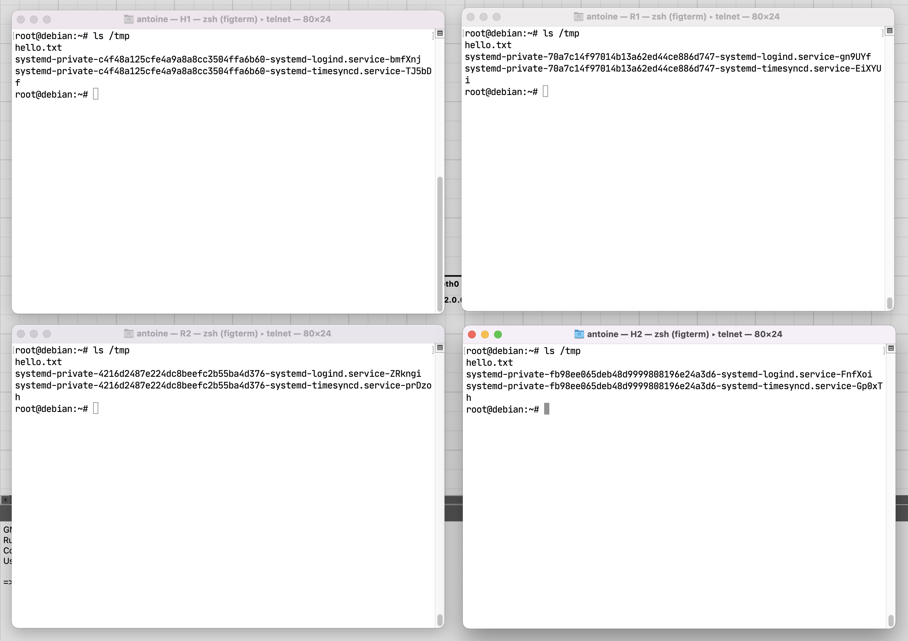

---
pdf_options:
  format: a4
  margin: 30mm 20mm
  printBackground: true
  headerTemplate: |-
    <style>
      section {
        margin: 0 auto;
        font-family: system-ui;
        font-size: 11px;
      }
    </style>
    <section>
      <span>Antoine Sutter</span>
    </section>
  footerTemplate: |-
    <section>
      <div>
        Page <span class="pageNumber"></span>
        / <span class="totalPages"></span>
      </div>
    </section>
---

# Labo 3

The first step is as usual to configure ssh to enable the ssh connections. Once this is done, ansible has been install with python using a python venv. You can install the requirements listed in requirements.txt with the following command:

```
pip install -r requirements.txt
```

Given the following requirements.txt file:

```
ansible==7.4.0
ansible-core==2.14.4
cffi==1.15.1
cryptography==40.0.2
Jinja2==3.1.2
MarkupSafe==2.1.2
packaging==23.1
pycparser==2.21
PyYAML==6.0
resolvelib==0.8.1
```

Then configure all the IPs for H1, H2, R1 and R2.

```
ssh H1 ip addr add 1.0.0.3/24 dev eth0
ssh H1 ip link set up dev eth0

ssh R1 ip addr add 1.0.0.1/24 dev eth1
ssh R1 ip link set up dev eth1
ssh R1 ip addr add 2.0.0.1/24 dev eth0
ssh R1 ip link set up dev eth0

ssh R2 ip addr add 2.0.0.2/24 dev eth0
ssh R2 ip link set up dev eth0
ssh R2 ip addr add 3.0.0.2/24 dev eth1
ssh R2 ip link set up dev eth1

ssh H2 ip addr add 3.0.0.3/24 dev eth0
ssh H2 ip link set up dev eth0
```

# ping

We can then test the base setup by running ansible:

```
ansible -m ping -i "H1,H2,R1,R2" all
```

And see that everything is working as expected.

```
R1 | SUCCESS => {
    "ansible_facts": {
        "discovered_interpreter_python": "/usr/bin/python3"
    },
    "changed": false,
    "ping": "pong"
}
H2 | SUCCESS => {
    "ansible_facts": {
        "discovered_interpreter_python": "/usr/bin/python3"
    },
    "changed": false,
    "ping": "pong"
}
R2 | SUCCESS => {
    "ansible_facts": {
        "discovered_interpreter_python": "/usr/bin/python3"
    },
    "changed": false,
    "ping": "pong"
}
H1 | SUCCESS => {
    "ansible_facts": {
        "discovered_interpreter_python": "/usr/bin/python3"
    },
    "changed": false,
    "ping": "pong"
}
```

The command ansible -m ping -i "H1,H2,R1,R2" all uses Ansible to ping the specified hosts. The -m ping flag specifies that the ping module should be used. The -i "H1,H2,R1,R2" flag specifies the inventory of hosts to be used, in this case H1, H2, R1, and R2. The all at the end specifies that the command should be run on all hosts in the inventory. This command will attempt to ping all four hosts and return the results.

# uptime

To display the uptime of all machines without writing an inventory file, you can use the following ad-hoc command:

```
ansible all -i "H1,H2,R1,R2," -m command -a "uptime"
```

```
R1 | CHANGED | rc=0 >>
 09:42:29 up 31 min,  2 users,  load average: 0.00, 0.00, 0.00
H2 | CHANGED | rc=0 >>
 09:42:29 up 31 min,  2 users,  load average: 0.01, 0.02, 0.00
R2 | CHANGED | rc=0 >>
 09:42:29 up 31 min,  2 users,  load average: 0.00, 0.00, 0.00
H1 | CHANGED | rc=0 >>
 09:42:29 up 31 min,  2 users,  load average: 0.00, 0.00, 0.00
```

This command uses the command module to run the uptime command on all hosts specified in the inventory. The -i "H1,H2,R1,R2," flag specifies the inventory of hosts to be used, in this case H1, H2, R1, and R2. The trailing comma is necessary to indicate that this is a list of hosts rather than a path to an inventory file.

# hello.txt

To create the file /tmp/hello.txt on all machines using an ad-hoc command, you can use the following command:

```
ansible all -i "H1,H2,R1,R2," -m file -a "path=/tmp/hello.txt state=touch"
```

```
R1 | CHANGED => {
    "ansible_facts": {
        "discovered_interpreter_python": "/usr/bin/python3"
    },
    "changed": true,
    "dest": "/tmp/hello.txt",
    "gid": 0,
    "group": "root",
    "mode": "0644",
    "owner": "root",
    "size": 0,
    "state": "file",
    "uid": 0
}
H2 | CHANGED => {
    "ansible_facts": {
        "discovered_interpreter_python": "/usr/bin/python3"
    },
    "changed": true,
    "dest": "/tmp/hello.txt",
    "gid": 0,
    "group": "root",
    "mode": "0644",
    "owner": "root",
    "size": 0,
    "state": "file",
    "uid": 0
}
R2 | CHANGED => {
    "ansible_facts": {
        "discovered_interpreter_python": "/usr/bin/python3"
    },
    "changed": true,
    "dest": "/tmp/hello.txt",
    "gid": 0,
    "group": "root",
    "mode": "0644",
    "owner": "root",
    "size": 0,
    "state": "file",
    "uid": 0
}
H1 | CHANGED => {
    "ansible_facts": {
        "discovered_interpreter_python": "/usr/bin/python3"
    },
    "changed": true,
    "dest": "/tmp/hello.txt",
    "gid": 0,
    "group": "root",
    "mode": "0644",
    "owner": "root",
    "size": 0,
    "state": "file",
    "uid": 0
}
```

We can see that the files has been successfully created on all machines.



# shell vs raw

The shell and raw modules in Ansible are both used to execute commands on remote hosts. The main difference between the two is that the shell module executes commands in a shell on the remote host via Python, while the raw module executes commands directly via SSH without using a shell or Python.

Here is an example of using the shell module to run a command on a remote host:

```
ansible all -i "H1,H2,R1,R2," -m shell -a "ls -l /tmp"
```

This command uses the shell module to run the ls -l /tmp command on all hosts specified in the inventory. The -i "H1,H2,R1,R2," flag specifies the inventory of hosts to be used, in this case H1, H2, R1, and R2. The trailing comma is necessary to indicate that this is a list of hosts rather than a path to an inventory file. The -a "ls -l /tmp" flag specifies the arguments to be passed to the shell module, in this case the command to be run.

Here is an example of using the raw module to run a command on a remote host:

```
ansible all -i "H1,H2,R1,R2," -m raw -a "ls -l /tmp"
```

This command uses the raw module to run the ls -l /tmp command on all hosts specified in the inventory. The -i "H1,H2,R1,R2," flag specifies the inventory of hosts to be used, in this case H1, H2, R1, and R2. The trailing comma is necessary to indicate that this is a list of hosts rather than a path to an inventory file. The -a "ls -l /tmp" flag specifies the arguments to be passed to the raw module, in this case the command to be run.

The main advantage of using the raw module over the shell module is that it can be used on systems that do not have a Python interpreter installed, since it does not require any additional modules or libraries. However, since it does not use a shell or Python, it does not support shell features such as variable expansion or command piping.

# Routing

To configure routing using ansible, a `host_vars` folder was created with one config file per host. The config files contain the information necessary to configure all the interfaces on the host.

For example here is H1.yml

```yml
interfaces:
  - iface_name: eth0
    ip_address: 1.0.0.3
    netmask: 255.255.255.0
    post_up: ip route add 0.0.0.0/0 via 1.0.0.1
```

And here is R1.yml

```yml
interfaces:
  - iface_name: eth0
    ip_address: 2.0.0.1
    netmask: 255.255.255.0
  - iface_name: eth1
    ip_address: 1.0.0.1
    netmask: 255.255.255.0
    post_up: ip route add 3.0.0.0/24 via 2.0.0.2
```

I also need to have an `inventory.ini` file that tells ansible who are my host and my routers.

```ini
[routers]
R1
R2

[hosts]
H1
H2
```

Finally my playbook is configured as follow:

```yml
- hosts: all
  tasks:
    - name: Configure network interfaces
      template:
        src: interfaces.j2
        dest: /etc/network/interfaces.d/{{ inventory_hostname }}.cfg
      loop: "{{ hostvars[inventory_hostname]['interfaces'] }}"
      notify:
        - Restart networking
  handlers:
    - name: Restart networking
      service:
        name: networking
        state: restarted
  post_tasks:
    - name: Test connection between H1 and H2
      when: inventory_hostname == 'H1'
      command: ping -c 1 {{ hostvars['H2']['interfaces'][0]['ip_address'] }}
    - name: Test connection between H2 and H1
      when: inventory_hostname == 'H2'
      command: ping -c 1 {{ hostvars['H1']['interfaces'][0]['ip_address'] }}
```

Each interface is configured using a template file called `interfaces.j2` that looks like this:

```jinja

auto {{ item.iface_name }}
iface {{ item.iface_name }} inet static
address {{ item.ip_address }}
netmask {{ item.netmask }}

post-up {{ item.post_up }}


```

And this will correctly format the config files, for example here is the generated `/etc/network/interfaces.d/H1.cfg` file:

```bash
auto eth0
iface eth0 inet static
address 1.0.0.3
netmask 255.255.255.0
post-up ip route add 0.0.0.0/0 via 1.0.0.1
```

You can then test the playbook file using the following command:

```bash
ansible-playbook --syntax-check -i inventory.ini playbook.yml
ansible-playbook --check -i inventory.ini playbook.yml
```

The --syntax-check and --check options of the ansible-playbook command are used to perform a dry run of a playbook without actually executing any tasks on the remote hosts.

The --syntax-check option performs a syntax check of the playbook to verify that it is valid and can be executed. This option does not connect to any remote hosts or execute any tasks, it simply checks the syntax of the playbook and reports any errors.

The --check option performs a dry run of the playbook to show what changes would be made if the playbook were executed. This option connects to the remote hosts and runs the tasks in check mode, which simulates the execution of the tasks without actually making any changes. The output of this command shows what changes would be made if the playbook were executed normally.

# ping

As you can see, H1 can now ping H2 and vice versa.

```
$ ssh H1 ping -c 1 3.0.0.3
PING 3.0.0.3 (3.0.0.3) 56(84) bytes of data.
64 bytes from 3.0.0.3: icmp_seq=1 ttl=62 time=3.09 ms

--- 3.0.0.3 ping statistics ---
1 packets transmitted, 1 received, 0% packet loss, time 0ms
rtt min/avg/max/mdev = 3.091/3.091/3.091/0.000 ms
```

```
$ ssh H2 ping -c 1 1.0.0.3
PING 1.0.0.3 (1.0.0.3) 56(84) bytes of data.
64 bytes from 1.0.0.3: icmp_seq=1 ttl=62 time=3.35 ms

--- 1.0.0.3 ping statistics ---
1 packets transmitted, 1 received, 0% packet loss, time 0ms
rtt min/avg/max/mdev = 3.346/3.346/3.346/0.000 ms
```

# nginx and wireguard

The first step is to get an ip using DHCP on the host to then being able to install nginx and wireguard. However we cannot do that over ssh because it would kill out connection so we need to use telnet instead. For this, I wrote an `expect` script that takes an IP and PORT from the arguments and then connects to the host using telnet. It then renew the DHCP lease to get an IP.

```bash
#!/usr/bin/expect -f
set timeout 5
set host [lindex $argv 0]
set port [lindex $argv 1]

spawn telnet $host $port
expect -re "> ?$"
send "dhclient -r\r"
send "dhclient -v mgmt0\r"
expect -re "> ?$"
send "exit\r"
expect eof
```

I then wrote a bash script that will parse the ssh config to extract the IP and PORT of each host and then run the expect script on each host.

```bash
#!/bin/bash
set -e

# Get the parent path of the script to run the telnet script
parent_path=$(cd "$(dirname "${BASH_SOURCE[0]}")" ; pwd -P)

# Get the IP and PORT of each host from the ssh config
H1_IP=$(ssh -G H1 | grep "hostname " | awk '{print $2}' | head -n 1)
H1_PORT=$(($(ssh -G H1 | grep "port " | awk '{print $2}'  | head -n 1) - 1))
H2_IP=$(ssh -G H2 | grep "hostname " | awk '{print $2}' | head -n 1)
H2_PORT=$(($(ssh -G H2 | grep "port " | awk '{print $2}' | head -n 1) - 1))

echo "H1_IP: $H1_IP"
echo "H1_PORT: $H1_PORT"

"$parent_path/telnet" $H1_IP $H1_PORT
"$parent_path/telnet" $H2_IP $H2_PORT

sleep 5

# ensure we can ping the internet
ssh H1 ping -c 1 8.8.8.8
ssh H2 ping -c 1 8.8.8.8
```

H1 and H2 now have access to the internet and we can install the packages we need.

```bash
ssh H1 apt install -y nginx wireguard curl
ssh H2 apt install -y nginx wireguard curl
```

These scripts have to be called manually and won't be part of the playbook.

# Playbook

Before configuring the playbook we need to generate public and private keypair for each host. This can be done using the following command:

```bash
ssh H1 "wg genkey | tee privatekey | wg pubkey > publickey"
ssh H2 "wg genkey | tee privatekey | wg pubkey > publickey"
```

Note that we won't bother using a vault in this example and will use the keys directly in the playbook. We can now add all the variables we need to the playbook.

```yaml
- name: wireguard on H1 and H2
  hosts: hosts
  vars:
    wg_private_key_h1: "kKlwvevRAcGwtk12aGmUNB1zJ5jqHOex3yagKV7DQHg="
    wg_private_key_h2: "AAKN+Y2SQELElTAmeHJ3Yd9HlEM89w5v4jRZDSa1wXQ="
    wg_public_key_h1: "2FBMUerJH+3ZKg60C39L9H/enp6E58P2Z9hDKbsplzc=="
    wg_public_key_h2: "TLW/uRJGvKtlrdqkv3oYD2T1VkfNYVpI5keuuZ5V5nw="
    wg_port: 51820
```

We can now start creating the tasks. The first one ensures we have an existing wg config file.

```yaml
tasks:
  - name: init wg
    file:
      path: /etc/wireguard/wg0.conf
      state: touch
```

Then for H1 and H2, we configure wireguard so they can each communicate with each other.

```yaml
- name: configure wg on h1
  when: inventory_hostname == "H1"
  template:
    src: wg0.conf.H1.j2
    dest: /etc/wireguard/wg0.conf
  register: wireguard_H1_configuration
  notify:
    - start wg
- name: configure wg on h2
  when: inventory_hostname == "H2"
  template:
    src: wg0.conf.H2.j2
    dest: /etc/wireguard/wg0.conf
  register: wireguard_H2_configuration
  notify:
    - start wg
```

And here are the following jinja templates.

`wg0.conf.H1.j2`

```jinja
[Interface]
PrivateKey={{ wg_private_key_h1 }}
Address=10.0.0.1/24
ListenPort={{ wg_port }}
SaveConfig=true

[Peer]
PublicKey={{ wg_public_key_h2 }}
AllowedIPs=10.0.0.2/32
Endpoint={{ hostvars['H2']['interfaces'][0]['ip_address'] }}:{{ wg_port }}
```

`wg0.conf.H2.j2`

```jinja
[Interface]
PrivateKey={{ wg_private_key_h2 }}
Address=10.0.0.2/24
ListenPort={{ wg_port }}
SaveConfig=true

[Peer]
PublicKey={{ wg_public_key_h1 }}
AllowedIPs=10.0.0.1/32
Endpoint={{ hostvars['H1']['interfaces'][0]['ip_address'] }}:{{ wg_port }}
```

Finally we have the handlers to start and stop wireguard.

```yaml
handlers:
  - name: start wg
    systemd:
      name: wg-quick@wg0
      state: restarted
```

From there we can take care of nginx. First my creating a config

```yaml
- name: nginx config for H2
  when: inventory_hostname == "H2"
  template:
    src: nginx.config.j2
    dest: /etc/nginx/sites-available/wireguard_site
    force: yes
```

Based on this template `nginx.html.j2`:

```jinja
server {
    listen 10.0.0.2:{{ wg_port }};

    root /var/www/html;
    index help.html;

    server_name _;

    location / {
        try_files $uri $uri/ =404;
    }
}
```

Then we create a simple html page:

```yaml
- name: create HTML file for H2
  when: inventory_hostname == "H2"
  template:
    src: nginx.html.j2
    dest: /var/www/html/help.html
```

Based on this HTML page:

```html
<!DOCTYPE html>
<html lang="en">
  <head>
    <meta charset="UTF-8" />
    <meta name="viewport" content="width=device-width, initial-scale=1.0" />
    <title>Kill me</title>
  </head>
  <body>
    <h1>I hate everything about this</h1>
    <p>Welcome to our Wireguard-connected web server. Please end me</p>
  </body>
</html>
```

Now we can enable our config and delete the default one.

```yaml
- name: enable nginx for H2
  when: inventory_hostname == "H2"
  file:
    src: /etc/nginx/sites-available/wireguard_site
    dest: /etc/nginx/sites-enabled/wireguard_site
    state: link
- name: remove default nginx config
  when: inventory_hostname == "H2"
  file:
    path: /etc/nginx/sites-enabled/default
    state: absent
```

Finally, ensure we restart nginx.

```yaml
- name: start nginx
  when: inventory_hostname == "H2"
  systemd:
    name: nginx
    state: restarted
```

# Testing

We can now test our setup. First we need to start the playbook.

```bash
ansible-playbook -i hosts playbook.yml
```

Then we can test that we can access the web server from H1.

```bash
ssh H1 curl 10.0.0.2:51820
```

```html
<!DOCTYPE html>
<html lang="en">
  <head>
    <meta charset="UTF-8" />
    <meta name="viewport" content="width=device-width, initial-scale=1.0" />
    <title>Kill me</title>
  </head>
  <body>
    <h1>I hate everything about this</h1>
    <p>Welcome to our Wireguard-connected web server. Please end me</p>
  </body>
</html>
```

Everything works!
