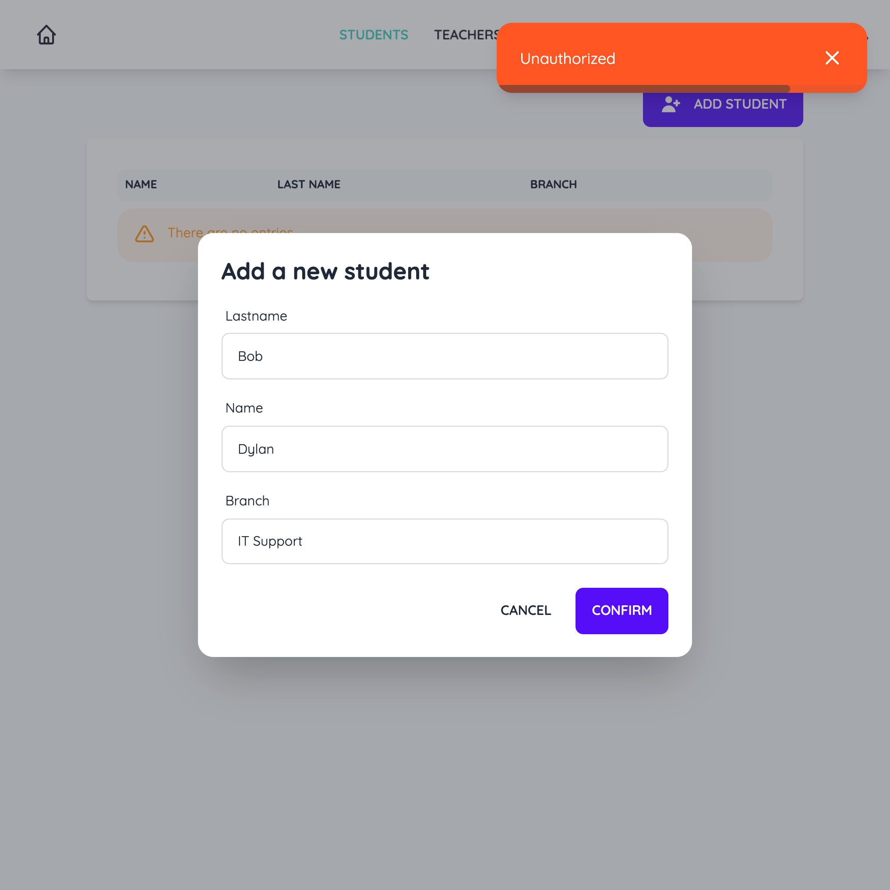

# Technologies

This project uses various technologies.

- The [Gin](https://github.com/gin-gonic/gin) framework for the backend (written in [Go](https://go.dev/))
- [GORM](https://gorm.io/index.html) for the database
- [Okta](https://www.okta.com/) for the authentification
- [Vue](https://v3.vuejs.org/) for the frontend

# Docker

This project uses [docker](https://www.docker.com/) with various containers described below.

## db

From [https://hub.docker.com/\_/mysql](https://hub.docker.com/_/mysql), this image is a simple mysql database and needs the following variables to be set in `.env` (see an example in `example.env`):

```
MYSQL_ROOT_PASSWORD
MYSQL_DATABASE
```

This image also has an `healthcheck` status to confirm to other images that the database is up and running. Used by the `go` docker image to not start the go application before the database is ready.

## go

From [https://hub.docker.com/\_/node/](https://hub.docker.com/_/node/) and [https://hub.docker.com/\_/golang/](https://hub.docker.com/_/golang/), this image will first build the JavaScript frontend into a static website and place the output in the `./frontend/dist/` directory.

After that, it will build the go backend. Then it will copy the generated files of the frontend into the go image in order to be statically served by the backend.

This image also depends on the `db` docker image to be healthy. This is because when we run `docker compose up`, we need the database to be ready before we start the go image as it will connect as soon as possible.

Finally, the image starts the application on the port `GO_PORT` but doesn't exposes it to the host as `nginx` will be used as a proxy.

This image needs the following variables to be set in `.env` (see an example in `example.env`):

```
GO_PORT
MYSQL_PORT
MYSQL_USER
MYSQL_DB
MYSQL_PASSWORD
```

## nginx

This image acts as a reverse proxy in order to setup a secure HTTPS connection. Keys were generated using `mkcert` (in a real application those keys should never be committed to the git history but because this is a POC and because those keys aren't used anywhere else, I've added them anyway for convinience).

Instead of hard coding values inside the nginx config, a `nginx-default.conf.template` file is used instead to populate it with environement variables.

Once is image has started, it exposes the `go` backend through HTTP on port 80 and HTTPS on port 443.

This image needs the following variables to be set in `.env` (see an example in `example.env`):

```
GO_PORT
```

## adminer

This is a simple [adminer](https://www.adminer.org/) image to be able to easily browse the sql database. Mostly used to debug.

# Workflow Example

Here is a visual representation of what a request to list of the students and then create a new one would look like.


First the user displays the list of students like so:

1. The client requests `GET /students`;
2. because that page doesn't exists, the JavaScript frontend framework is statically served instead (`./frontend/dist/index.html`);
3. `index.html` needs the list of students so the client requests `GET /api/students`;
4. because that endpoint is available to everyone, the backend responds with the list of students.

Then the user creates a new student like so:

5. The client posts to `POST /api/students` with the new student's information;
6. because that endpoint is only available to logged in users, the backend responds with a status code of 401 (Unauthorized);
7. therefore, `index.html` redircts to the application's okta login page;
8. okta responds with the login page;
9. the user logins using his email and password to okta;
10. okta responds (hopefully) status code 200 (Ok) and return the JWT token to the client;
11. the client posts to `POST /api/students` again but this time providing the JWT token returned by Okta in the request header;
12. because the JWT is valid, the backend responds with the status code 201 (Created) to confirm the student was created.

# Project structure

## `./controllers/`

Contains the controllers for teachers and students endpoints for `GET` and `POST` requests. This code isn't responsable of authorisation and is thus fairy simple. For example, the following code is responsible for listing all the students from the database.

```go
func GetStudentsHandler(c *gin.Context) {
	var students []model.Student
	database.DB.Model(model.Student{}).Find(&students)

	c.JSON(http.StatusOK, SuccessResponse{
		Data: students,
	})
}
```

## `./database/`

Contains the code responsible for initialise, migrate and connect to the database, using [GORM](https://gorm.io/index.html). The code expects a MySQL connection and the following env variables need to be set accordingly in `.env` (see an example in `example.env`):

```bash
MYSQL_HOST
MYSQL_PORT
MYSQL_USER
MYSQL_DB
MYSQL_PASSWORD
```

Gorm will uses the models from the `./model/` package to create the database tables accordingly. Once created, the package exposes a `DB *gorm.DB` variable for other packages to use.

## `./docker/ and ./docker-compose.yml`

Contains all the relevant files for all the docker configuration. For more information, see the `docker` section.

## `./env/`

Simple wrapper package around the `os.Getenv` function that will throw exceptions when a variable isn't set or is set to an empty value instead of quitely returning an empty string like the regular package does.

## `./frontend/`

[Vue](https://v3.vuejs.org/) project for the frontend. The application redirects to Okta if the user is not logged in in order to reciece a JWT token. That token is then send to the `go` backend to be validated.

For more information on how the frontend works, see `./frontend/README.md`

## `./middlewares/`

Contains the 2 middlewares for this project.

### `auth.go`

Contains middlewares responsible for the authentification.

The `AuthMiddleware` middleware uses [`okta-jwt-verifier-golang`](https://github.com/okta/okta-jwt-verifier-golang) to verify the token and expects a JWT token in the Authorization header of the requests. If the validation fails, a HTTP code `401 StatusUnauthorized` is returned. Otherwise, the decoded token token is saved in the context for potential further use.

The `EmailMiddleware` middleware uses the decoded token saved by `AuthMiddleware` and then verifies that the current user's email match an aritrary email value. If the validation fails, a HTTP code `401 StatusUnauthorized` is returned. Otherwise, the request continues.

### `cors.go`

This simple middleware uses [`rs/cors`](https://github.com/rs/cors) to allow cross origin requests to the API (needed by the frontend).

## `./model/`

Contains all the models used in the application. Those models are also used by the `database` package to create the tables accordingly.

## `./router/`

Package responsible to setup the gin router. Many important things happen here:

- the GIN router is created;
- the CORS middleware is added for all routes;
- because we're using a static JavaScript frontend, we statically serve any file from `./frontend/dist`;
- then the `/api` group is created containing;
  - `GET /students` to list the students. This endpoint is accessible by everyone;
  - `GET /teachers` to list the teachers. This endpoint is accessible by everyone;
  - then the `AuthMiddleware` is used, meaning that all the routes below requires authentification;
  - `POST /students` to create a new student. This endpoint is only accessible to one specific user (in this case, `test@gmail.com`) thank to the `EmailMiddleware`;
  - `POST /teachers` to create a new student. This endpoint is only accessible to one specific user (in this case, `test@gmail.com`) thank to the `EmailMiddleware`;
  - `DELETE /students` to create a new student. This endpoint is only accessible to one specific user (in this case, `johndoe@gmail.com`) thank to the `EmailMiddleware`;
  - `DELETE /teachers` to create a new student. This endpoint is only accessible to one specific user (in this case, `johndoe@gmail.com`) thank to the `EmailMiddleware`;
- finally, for the frontend router to work, we redirect all `404` pages to `./frontend/dist/index.html`.

## `.env`

The file where all the environement variables need to be. See `example.env`:

```
GO_PORT=3000
MYSQL_HOST=localhost
MYSQL_PORT=3306
MYSQL_USER=root
MYSQL_DB=myapp
MYSQL_PASSWORD=example
ADMINER_PORT=1337

OKTA_CLIENT_ID=${yourClientId}
OKTA_ISSUER=https://${yourOktaDomain}/oauth2/${authorizationServerId}

# Relative env variables for the frontend
VITE_BACKEND=${GO_PORT}
VITE_OKTA_CLIENT_ID=${OKTA_CLIENT_ID}
VITE_OKTA_CLIENT_SECRET=${OKTA_CLIENT_SECRET}
VITE_OKTA_ISSUER=${OKTA_ISSUER}
```

## `go.mod`

See [https://go.dev/doc/modules/gomod-ref](https://go.dev/doc/modules/gomod-ref)

## `main.go`

Entry point responsible for initialising the entire app.

# Run

To run the application, run `docker`:

```
docker compose up
```

Then access the site on [`https://localhost`](https://localhost).

# Run locally

To run the application locally, run `make run`.
Then access the site on [`http://localhost:3000`](http://localhost:3000)

# Screenshots





